# Study Buddy Bot

> Cloud-deployed Telegram chatbot powered by the HKBU OpenAI LLM for study support — PDF Q&A, quizzes, summaries, and study planning — with Docker + CI/CD + monitoring.

**Live bot:** [@GoStudyBuddyBot](https://t.me/GoStudyBuddyBot) 🚀

## Overview

Students struggle to review large study materials (lecture slides, PDFs), and existing tools are passive — they don't drive interactive learning. **Study Buddy Bot** is a production-grade AI learning assistant that turns uploaded PDFs into an interactive study experience using **Retrieval-Augmented Generation (RAG)** and **cloud-native DevOps**.

## Features

- **PDF Q&A** — RAG-grounded answers from uploaded study materials.
- **Quiz generation** — multiple-choice quizzes generated from uploaded content.
- **Progress tracking** — quiz performance history and weak topics.
- **Summarization** — condensed key points from documents.
- **Study planning** — structured weekly study timetable.
- **LLM integration** — HKBU OpenAI-compatible REST API.
- **Database logging** — messages, events, quizzes, and quiz attempts.
- **Monitoring** — `/health` and `/metrics` endpoints.
- **Cost/abuse guardrails** — per-user rate limiting and daily LLM token budgets.
- **Containerized + CI/CD** — Docker runtime with a test → build → deploy pipeline.

### Commands

| Command | Description |
| --- | --- |
| `/start` | Initialize the bot and start a new session |
| `/ask` | Ask questions about uploaded study materials (RAG-grounded) |
| `/quiz` | Generate multiple-choice quizzes from uploaded content |
| `/progress` | View quiz performance and learning progress |
| `/summarize` | Summarize uploaded documents into key points |
| `/plan` | Generate a structured weekly study plan |
| `/endsession` | Clear session data and reset context |

## Architecture

The bot uses a **stateless design combined with AWS RDS** so that data persists beyond the container lifecycle, allowing reliable redeployments during CI/CD.

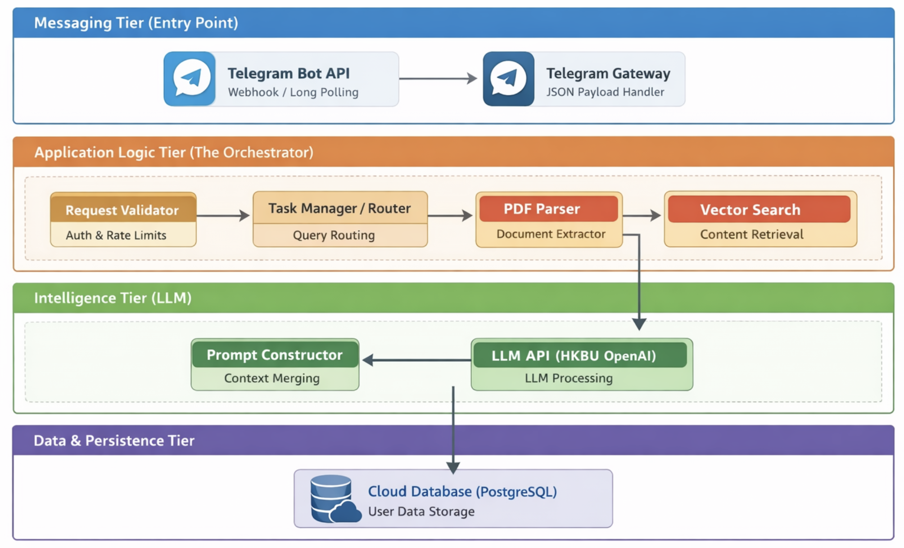

**Workflow:** `User → Telegram Bot API → Request Validator → RAG Engine → Intelligence (HKBU OpenAI) → Persistence (AWS RDS)`

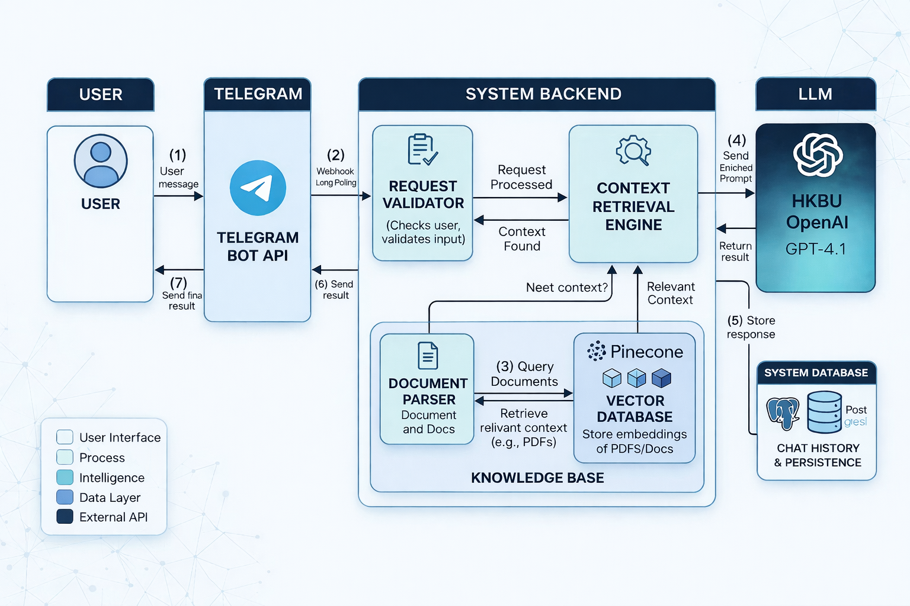

### Tiers
- **Messaging tier (inbound):** Telegram Bot API (`python-telegram-bot`) and request validation.
- **Application logic tier (the "engine"):** RAG engine with text splitting and similarity-based chunk retrieval.
- **Intelligence tier (processing):** HKBU OpenAI (GPT-4o) with structured prompt templates.
- **Persistence tier (data store):** AWS RDS (PostgreSQL).

## Technology Stack
- **Client layer:** Telegram app + Telegram Bot API commands
- **Application layer (Python):** command handlers (`/ask`, `/quiz`, `/summarize`, `/plan`, `/progress`), session/state management, input validation and orchestration
- **AI layer:** HKBU OpenAI-compatible LLM REST API, prompt pipelines for Q&A / summarization / quiz generation / study planning, token-usage tracking and daily budget control
- **RAG / document layer:** PDF upload and extraction, chunk retrieval for context-grounded answers, source-aware response generation
- **Data layer:** PostgreSQL for event/message logging and quiz attempts, scores, and progress history
- **Ops & reliability layer:** Docker + Docker Compose, GitHub Actions CI/CD (test, build, deploy to EC2), `/health` and `/metrics` endpoints, rate limiting and runtime logging

## Quick Start (Local)
1. Install dependencies:
   ```sh
   pip install -r requirements.txt
   ```
2. Configure `.env` with bot, LLM, and DB credentials.
3. Run with Docker Compose (cloud DB):
   ```sh
   docker compose up -d --build bot
   ```
4. Optional local Postgres only for development:
   ```sh
   COMPOSE_PROFILES=localdb docker compose up -d --build
   ```

## Environment Variables
Required in `.env`:
- `TELEGRAM_BOT_TOKEN`
- `LLM_API_KEY`
- `LLM_BASE_URL`
- `LLM_MODEL`
- `LLM_API_VER`

Database configuration (supported patterns):
1. Preferred single URL:
   - `DATABASE_URL=postgresql://<user>:<password>@<host>:5432/<db>`
2. Backward-compatible components:
   - `DB_HOST` (either hostname or full URL)
   - `DB_USER`
   - `DB_PASSWORD`
   - `DB_NAME`
   - `DB_PORT` (optional, default `5432`)

Runtime/monitoring controls:
- `HEALTH_PORT` (default `8081`)
- `MAX_DAILY_TOKENS` (default `120000`)
- `REQUEST_WINDOW_SECONDS` (default `60`)
- `MAX_REQUESTS_PER_WINDOW` (default `20`)
- `REQUIRE_CLOUD_DB` (default `true` in Docker Compose)

## Project Structure
- `bot/`: production Telegram bot runtime (`python -m bot.main`)
- `src/`: alternate implementation tree kept for reference
- `database/`: DB client and persistence helpers
- `llm/`: LLM client modules
- `monitoring/`: monitoring notes and alert guidance
- `tests/`: pytest suite
- `.github/workflows/`: CI/CD workflow

## Cloud Infrastructure (AWS)
- **Instance:** `t2.micro` (free-tier eligible), running the bot 24/7.
- **Runtime:** Docker containers on EC2, receiving Telegram webhook callbacks / long-polling requests.
- **Security group:** inbound traffic allowed from the Telegram API only.
- **Database access:** the EC2 instance is the only client allowed to connect to the cloud PostgreSQL.

## Cloud Deployment & CI/CD (GitHub Actions)
- Workflow file: `.github/workflows/ci.yml`
- Fully automated pipeline triggered on push to `main`/`master` (and pull requests).

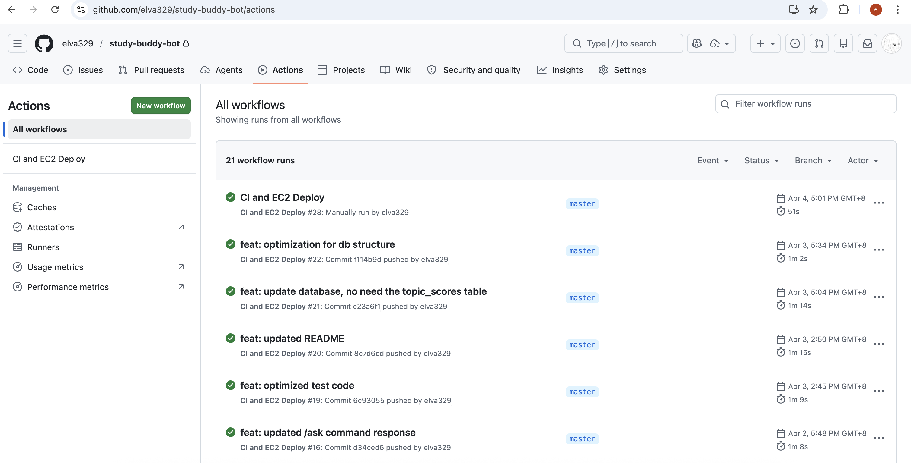

Pipeline stages:
1. **QA** — install dependencies and run the `pytest` suite.
2. **Smoke check** — automated script verifies database connectivity before building.
3. **Build** — builds a production-ready Docker image.
4. **Deploy** — remote SSH trigger uploads the code bundle to EC2 and runs `docker compose up -d --build bot`.

Important:
- Keep EC2 `.env` with cloud DB credentials.
- Do not open DB port `5432` to `0.0.0.0/0`; allow the EC2 security group only.

## Database & Data Management
- **Infrastructure:** Amazon RDS (managed PostgreSQL) for industrial reliability.

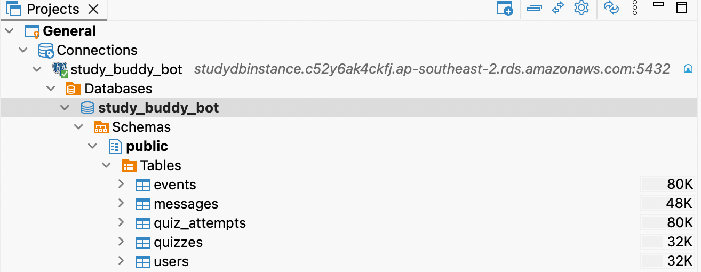

- **Relational schema:**

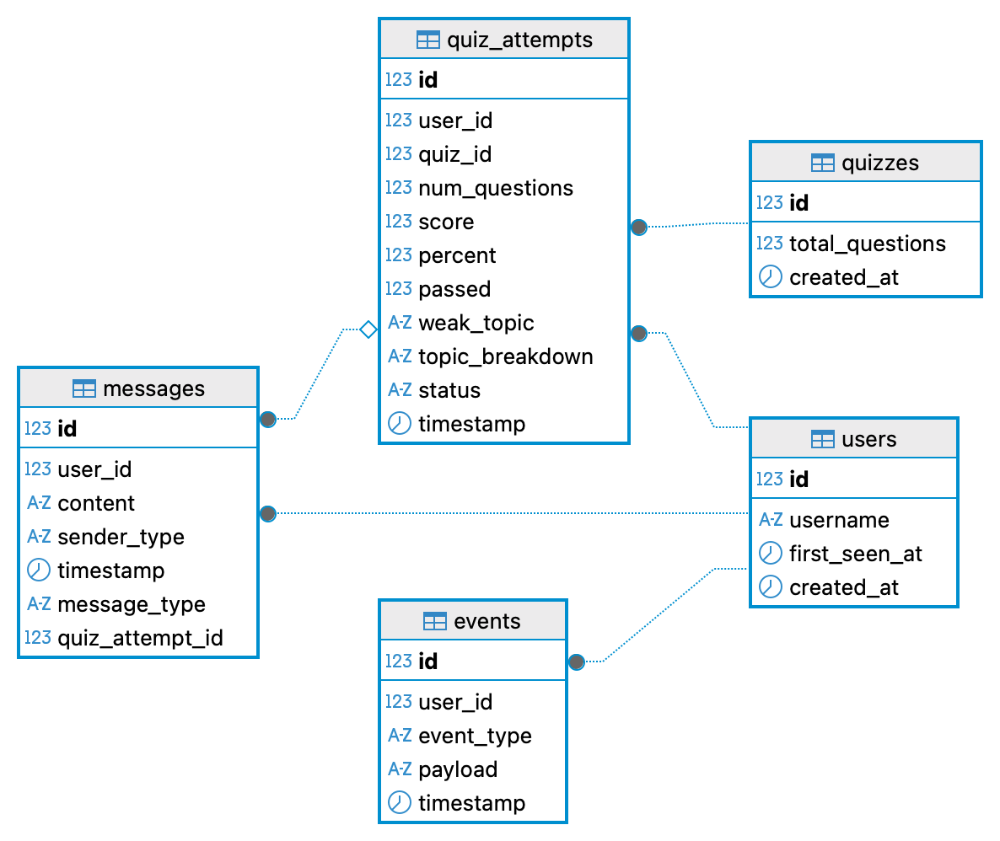

  - `users` — tracks preferences and handshakes.
  - `messages` & `events` — complete audit trail for system monitoring.
  - `quiz_attempts` & `quizzes` — stores performance data for `/progress` analytics.
- **Security:** data-at-rest encryption plus security groups restricted to the EC2 private IP (no public database access).

### Database Queries

| `users` | `events` | `quizzes` |
| --- | --- | --- |
|  |  |  |

## Monitoring & Cost Control
Observability is exposed on port `8081`:

| Endpoint | Purpose |
| --- | --- |
| `/health` | system status + uptime |
| `/metrics` | request counts + token consumption |

Health check:
```sh
curl http://localhost:8081/health
```

Metrics check:
```sh
curl http://localhost:8081/metrics
```

Database counters check:
```sh
sudo docker compose exec -T bot python - <<'PY'
from database.db_client import get_db_overview, DB_URL
print('DB URL scheme:', DB_URL.split(':', 1)[0])
print(get_db_overview())
PY
```

### Cost Control Mechanisms

| Mechanism | Default |
| --- | --- |
| Rate limiting | 20 requests / 60 sec per user |
| Daily token budget | 120,000 tokens per user |
| Efficient prompts | task-specific templates |
| Cloud DB requirement | production enforcement |

- Month-to-date cost: **$0.00** (optimized for AWS Free Tier).
- After 6 months the estimated monthly cost is ~$20–25/month; the bot can be migrated to lower-cost alternatives (local hosting, lighter instances) if needed.

## Tests
Run locally:
```sh
pytest -q
```

## Requirements Fulfilment

| Requirement | Status |
| --- | --- |
| Telegram chatbot | ✅ |
| Cloud database (PostgreSQL) | ✅ |
| Cloud deployment (AWS EC2) | ✅ |
| LLM API (HKBU OpenAI) | ✅ |
| Git version control | ✅ |
| Containerization (Docker) | ✅ |
| CI/CD (GitHub Actions) | ✅ |
| Monitoring (`/health`, `/metrics`) | ✅ |
| Cost control (rate limiting, token budget) | ✅ |

## Screenshots

| `/start` | `/ask` |
| --- | --- |
| 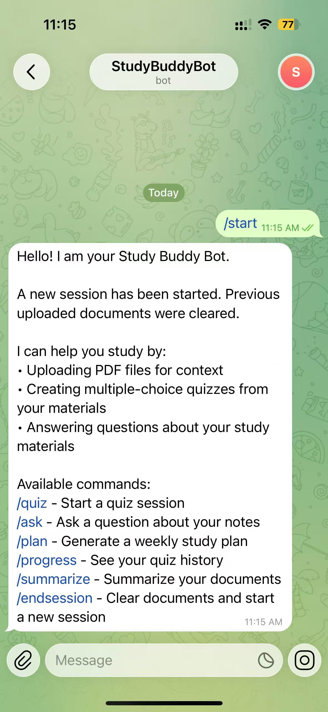 | 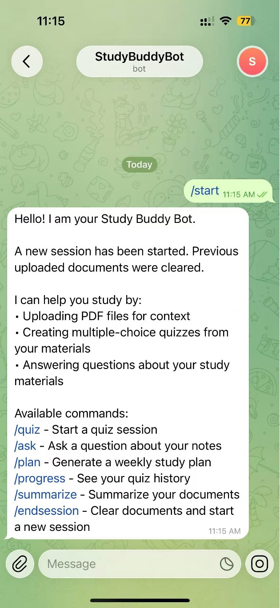 |

| `/quiz` | `/progress` |
| --- | --- |
| 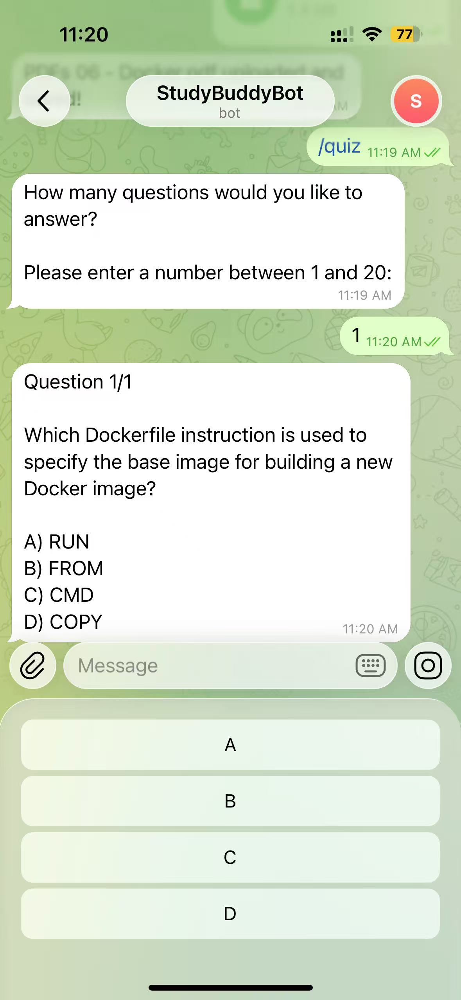 | 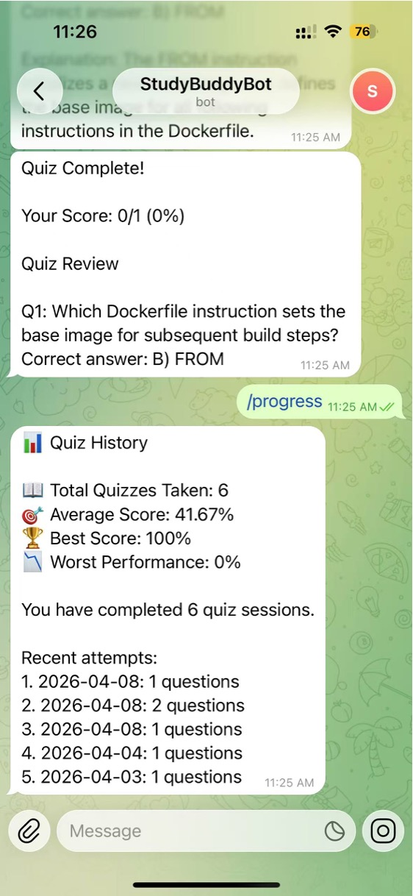 |

| `/summarize` | `/plan` |
| --- | --- |
| 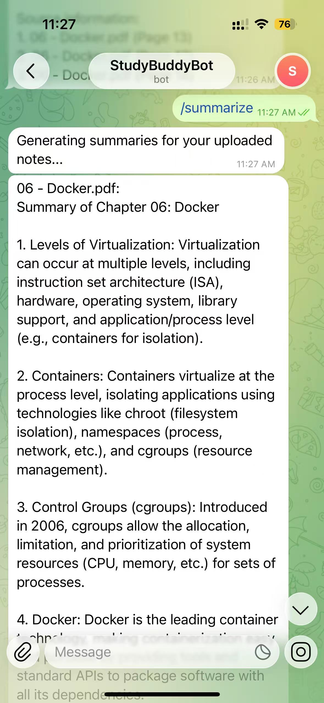 | 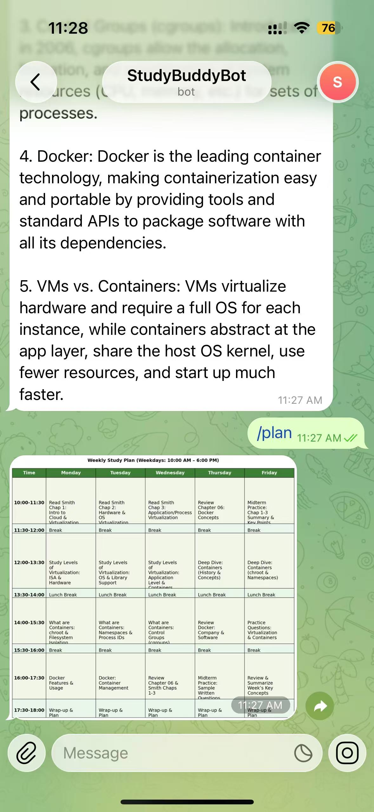 |

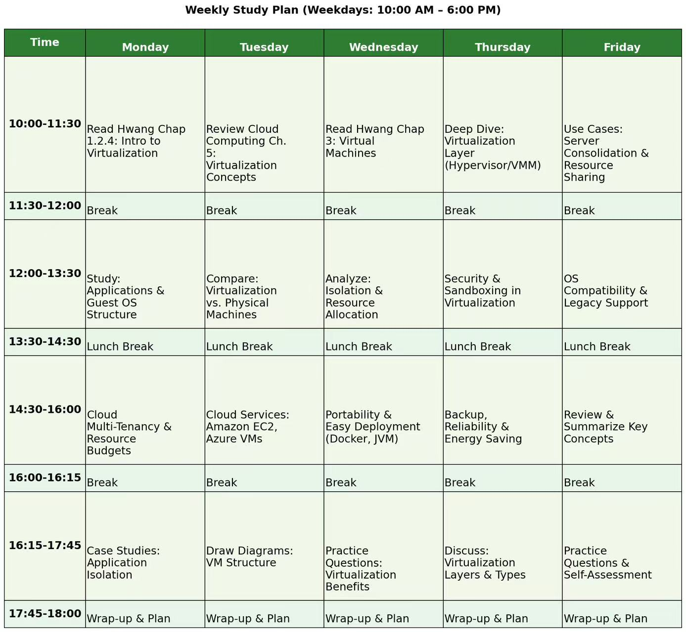

| `/endsession` |
| --- |
| 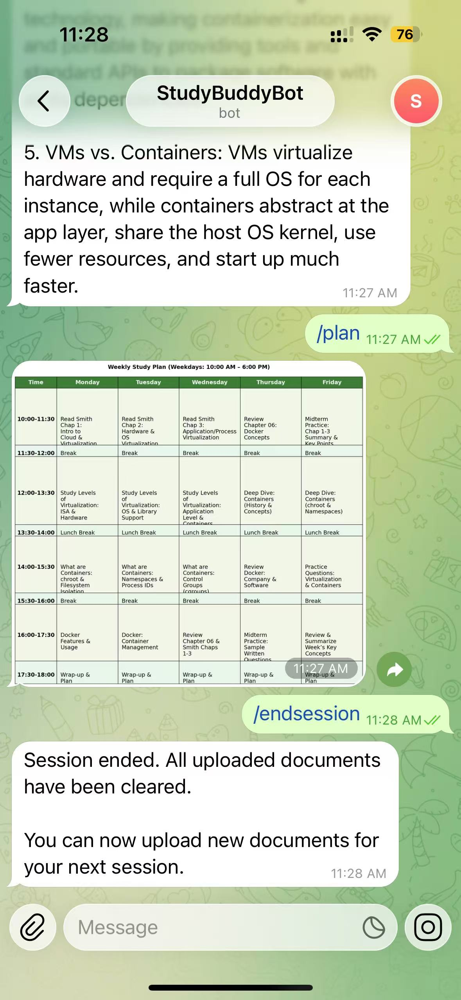 |
